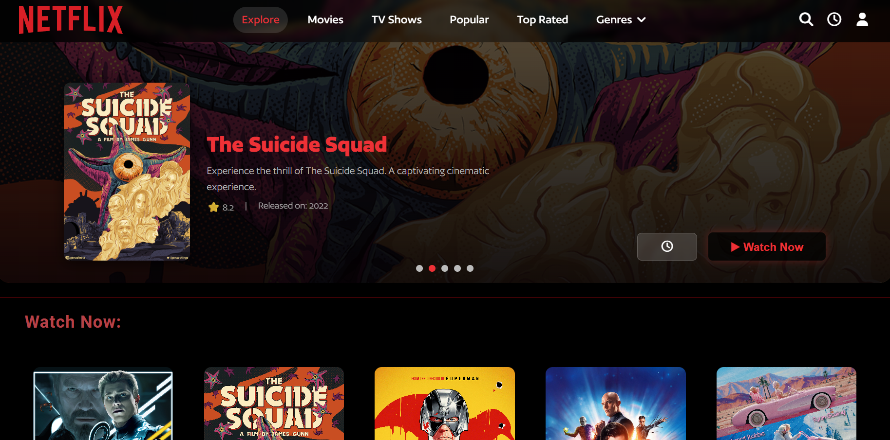

🎬 Netflix Web App Prototype
<div align="center"> <a href="https://github.com/asifkfaiz/AL-IMTEDAD-Interview-Task-Netflix-Clone">  </a> <p align="center"> A responsive Netflix-style web app prototype built for an interview assessment. <br/> Built with React (frontend) and Node.js/Express (backend), this prototype demonstrates API integration, responsive UI, and dynamic media playback. <br/> <br/> <a href="#about-the-project"><strong>Explore Features »</strong></a> <br/> <br/> </p> </div>


## <strong> About the Project: </strong>




This project is a fully responsive Netflix web app prototype designed for an interview evaluation. It showcases:
- Hover-based movie previews (native `<video>` tag).
- Full-screen playback using an embedded YouTube iframe.
- Backend logging for playback routes (e.g., `Superman is playing`).
- Responsive layout with fluid hover effects and animations.
- Mobile-ready navigation with a collapsible hamburger menu.
- All movies and previews are dynamically loaded from a mock API (`/movies`), with local assets managed via JSON.


## <strong>Built With</strong> 

* [![Node][Node.js]][Node-url]
* [![React][React.js]][React-url]


## <strong>Project Setup</strong> 
### 🧩 Prerequisites:

<strong>Make sure you have installed:</strong> <strong></strong>

>Node.js (v18 or later)

>npm (v9 or later)

### <strong>⚙️ Backend Setup:</strong>


Navigate to the backend folder:

```sh
cd backend
```


Install dependencies:

```sh
npm install
```


Start the backend server:

```sh
npm start
```


<strong>The backend will run on:</strong>

- `http://localhost:3000`

### <strong>💻 Frontend Setup:</strong>


Navigate to the frontend folder:

```sh
cd frontend
```


Install dependencies:

```sh
npm install
```


Start the development server:

```sh
npm run dev
```


The frontend will run on:

- `http://localhost:5173`

### <strong>🔗 Connecting Both</strong>

Ensure your backend is running before launching the frontend.
The frontend fetches data from `http://localhost:3000/movies` (configured in `movieService.js`).


<br><br>


## <strong>Folder Structure</strong> 
```sh

NetflixClone_Interview/
│
├── backend/
│   ├── server.js
│   ├── routes/
│   ├── controllers/
│   ├── movies.json
│   ├── assets/
│   └── package.json
│
└── frontend/
    ├── src/
    ├── public/
    ├── package.json
    └── vite.config.js

```


<!-- LINKSSSSSS -->

[Node.js]: https://img.shields.io/badge/node.js-339933?style=for-the-badge&logo=nodedotjs&logoColor=white
[Node-url]: https://nodejs.org/

[React.js]: https://img.shields.io/badge/react-20232a?style=for-the-badge&logo=react&logoColor=61dafb
[React-url]: https://react.dev/
